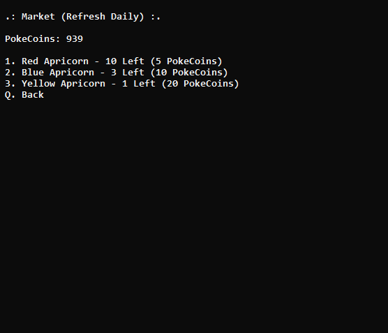
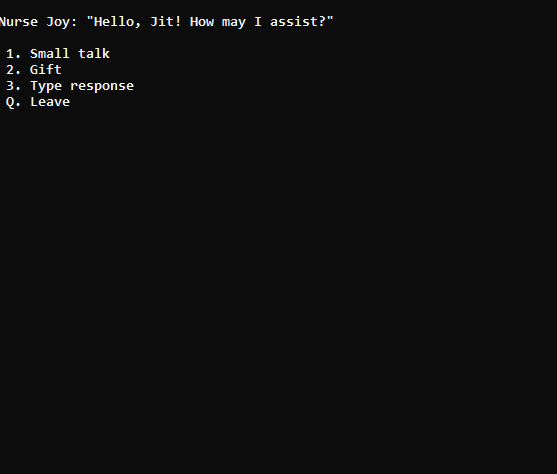

# Batch Games Public Archive

These are some of my most significant batch projects, created over the course of my journey learning batch, my first ever programming language.

This was back when I rarely finished any project I started and I couldnt get help from anybody, only a couple YouTube tutorials, articles, and public GitHub repos (AI wasnt accessible yet). I mainly just used command prompt and either Notepad or Notepad++ to create them.

> Some of the projects include folder icons

### [Pizza Simulator Lite v1.1](./Pizza%20Simulator%20Lite%20v1.1)

A simple pizza simulator with a few basic features and no game saving, predecessor to Pizza Simulator v2.

> Created: **2/26/21**
>
> Last Updated: **3/18/21**
>
> Size: **9.38 KB** (Directory: **11.2 KB**)
>
> Progress: **100%**
>
> Audio: **No**
>
> Playable: **Yes**

More Screenshots

### [The Useless Game](./The%20Useless%20Game)

What the title describes it as, a useless game. Press the key that appears in the box, until you don't press the key that appears in the box, and lose. Highest score is saved.

> Created: **Sometime Before 5/19/21, Go Figure**
>
> Last Updated: **5/19/21**
>
> Size: **1.64 KB**
>
> Progress: **100%**
>
> Audio: **No**
>
> Playable: **Yes**

More Screenshots

### [Pizza Simulator v2](./Pizza%20Simulator%20v2)

A fully-featured pizza simulator where the user bakes pizza then sells it for cash, which can be used to buy more pizza machines increasing baking efficiency, gamble it on a 50/50 chance of doubling, or spent in the Rich Shop. Users must first login to play, which saves all data and configs under your user's save file.

> Created: **7/8/21**
>
> Last Updated: **4/21/22**
>
> Size: **14.8 KB** (Directory: **67.5 KB**)
>
> Progress: **100%**
>
> Audio: **No**
>
> Playable: **Yes**

More Screenshots

### [RotBG Exalt](./RotBG%20Exalt)

Based off of the 8-bit bullethell MMORPG [Realm of the Mad God Exalt](https://www.realmeye.com/wiki/realm-of-the-mad-god), only text-based. This is intended to function just like the original game, where you defeat mobs, collect loot, horde it in your vault, raise pets, and ultimately face death in which you'll gain fame. This project is severely undeveloped and there's nothing more than character management so far (and probably will never get updates), but it's cool to see what could've been. The game (or at least currently the user/characters) is saved when you're in the Nexus, and you can have different users except now with a handy auto-login toggle (found in options).

> Created: **12/1/21**
>
> Last Updated: **2/8/23**
>
> Size: **11.0 KB** (Directory: **26.7 MB**)
>
> Progress: **5%**
>
> Audio: **Yes**
>
> Playable: **No**

More Screenshots

### [Batch Pokemon v1.1](./Batch%20Pokemon%20v1.1)

Just like RotBG, this was created to function just like the original Pokemon games but made into a simple game loop. However, the Expedition mode's Pokemon battles was never fully completed so you can't really fight or catch new Pokemon. The only thing the user can do is browse the market, create pokeballs from the cram-o-matic using apricorns, or chat with Nurse Joy. This was made before i've ever even played a virtual Pokemon game (was big into the trading cards), so I hardly knew about the concepts. The game is always saved with no user login.

> Created: **4/21/22**
>
> Last Updated: **7/14/22**
>
> Size: **17.3 KB** (Directory: **34.5 MB**)
>
> Progress: **10%**
>
> Audio: **Yes**
>
> Playable: **Kinda**

More Screenshots

### [Gacha Grinder](./Gacha%20Grinder)

Nothing but a simple gacha box-opening game, where the only way to obtain cash is through the daily rewards, and the more gacha creatures you've collected the more cash you get daily. You can inspect what creatures you've collected with Q. The game is always saved with no user login.

> Created: **6/29/22**
>
> Last Updated: **8/21/22**
>
> Size: **15.6 KB** (Directory: **2.90 MB**)
>
> Progress: **80%**
>
> Audio: **Yes**
>
> Playable: **Yes**

More Screenshots

### [Strange Encounters](./Strange%20Encounters)

My first attempt at randomly generated chunks, or "rooms". Being big into Minecraft I somewhat grasped the concept of the X/Y coordinates of chunks, so this is what I came up with. But don't expect more than a 50/50 chance for each of the 4 sides of directions you can go and that's all I could really do. This game is about spawning in a room at (0, 0) and trying to find the way out at a per-level ever-increasing X/Y upper limit. You simply have to travel in 1 of 4 directions avoiding the walls in your way while managing your stamina, and it was intended to have monsters searching for the player (sleeping increases the risk) which could cause death, but I never really got to it. The more levels you've completed, the more XP you gain at the end, which you can quit at anytime to collect. Progress can be saved with no user login.

> Created: **Likely Before 7/17/22**
>
> Last Updated: **7/22/22**
>
> Size: **9.99 KB** (Directory: **25.4 MB**)
>
> Progress: **30%**
>
> Audio: **Yes**
>
> Playable: **Kinda**

More Screenshots

### [The Phantom Realm Rush](./The%20Phantom%20Realm%20Rush)

A successor of my "The Phantom Realm" series games, that all were never really playable until this release. The gist is that the player fights in quick mini battles where all you see is the results (HP loss, XP gain, whatever). You can buy items from the Shop to, well, keep you alive or to benefit from stackable boosts. The Blacksmith is an incomplete shop where you can spend rare gems that never made it into the actual gameplay. Once you gain enough XP, you'll level up with more max HP/MP. Once your MP is full, you can unleash a powerful attack which rewards up to triple the Realm Cash. If the player's HP reaches 0, they will die and any levels, cash, or items you had will be reset.

> Created: **Likely Before 7/21/22**
>
> Last Updated: **8/15/22**
>
> Size: **9.67 KB** (Directory: **11.1 MB**)
>
> Progress: **60%**
>
> Audio: **Yes**
>
> Playable: **Yes**

More Screenshots

### [WAIFU](./WAIFU)

A command line assistant designed to launch apps and so and so quickly through navigation of one of the directories in .folders by entering the number of the desired item in the list. It can also do other things such as opening URLs (unimplemented, although you can create a shortcut for that in QA or the .folders directory), launch telnets by specifying the URL or browsing the ones provided in the telnets.txt file, or simply looking at the date/time which can be seen from any screen. To open Quick Access (QA), press enter without any prompt and you can launch any of the programs there faster. Adding/removing QA shortcuts is done through the menu and saved to a file.

> Created: **Likely Before 12/20/23**
>
> Last Updated: **Sometime Before 1/20/24**
>
> Size: **6.73 KB** (Directory: **76.0 KB**)
>
> Progress: **90%**

More Screenshots

